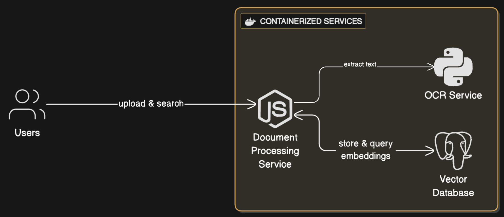

# RAG System – Retrieval-Augmented Generation App

This is a Retrieval-Augmented Generation (RAG) system that enables text extraction from uploaded documents (images or PDFs), stores the extracted data with vector embeddings in a PostgreSQL (pgvector-enabled) database, and allows semantic search over that data.

Built using:

- **Node.js** (Express) for the primary API backend
- **Python Flask** for OCR service using **EasyOCR**
- **PostgreSQL with pgvector** for vector-based similarity search
- **Docker & Docker Compose** for containerized setup

---

## System Architecture



---

## Features

- File upload support for PDFs and images only
- OCR-powered text extraction (via EasyOCR in Flask)
- Embedding and storage in `pgvector` database
- Semantic search over stored documents
- Swagger UI documentation
- Rate limiting to avoid abuse
- Full Dockerized environment

---

## Endpoints

### 1. **POST** `/api/v1/upload`

Uploads a PDF or image file, extracts text using OCR, computes embeddings, and stores them.

- Accepts: `multipart/form-data`
- Validates file type (PDF or image only)
- If image, OCR is done using the Flask service with EasyOCR
- If PDF, text is extracted directly using `pdf-parse`
- Embeddings are generated and stored in `pgvector`

### 2. **GET** `/api/v1/search?q=question`

Performs a semantic search against stored document embeddings.

- Accepts query string
- Returns relevant results based on cosine similarity

---

## Prerequisites

- Docker and Docker Compose installed on system.
- Node.js and npm (for local development outside Docker).
- Python 3.8+ (for the OCR service if running locally).

---

## Setup Instructions

### 1. Clone the Repository

```bash
git clone https://github.com/Bishalmoktan/RAG.git
cd RAG
```

### 2. Start the Application

Run the following command to build and start all services:

```bash
docker-compose up --build
```

This will:

- Start the PostgreSQL database on port `5432`.
- Start the Node & Express backend on port `3000`.
- Start the Flask OCR service on port `5001`.

### 4. Access the Application

- **API Endpoints**: Access the API at `http://localhost:3000`.
- **Swagger UI**: View API documentation at `http://localhost:3000/api-docs`.
- **OCR Service**: The Flask OCR service is available at `http://localhost:5001` (used internally by the backend).

### 5. Stop the Application

To stop the running containers:

```bash
docker-compose down
```

To remove volumes (e.g., to clear the database):

```bash
docker-compose down -v
```

---

## API Endpoints

### 1. Upload File (`/api/v1/upload`)

- **Method**: `POST`
- **Description**: Uploads an image or PDF file. Images are processed by the Flask OCR service using EasyOCR to extract text, which is then stored in the PostgreSQL database with vector embeddings.
- **Request**:
  - Content-Type: `multipart/form-data`
  - Body: File (image: `.png`, `.jpg`, `.jpeg`; PDF: `.pdf`)
- **Response**:
  - `200`: Success with details of the processed file.
  - `400`: Invalid file type or other client errors.
- **Rate Limiting**: Applied to prevent abuse.

### 2. Search (`/api/v1/search`)

- **Method**: `POST`
- **Description**: Performs a vector-based search on stored data using `pgvector`.
- **Request**:
  - query: `{ "q": "<search-text>" }`
- **Response**:
  - `200`: Returns matching results based on vector similarity.
  - `400`: Invalid query or other client errors.
- **Rate Limiting**: Applied to prevent abuse.

### 3. Swagger UI

- **URL**: `http://localhost:3000/api-docs`
- **Description**: Interactive API documentation to test and explore the `/api/v1/upload` and `/api/v1/search` endpoints.

---

## Project Structure

```
├── server/                 # Node.js Express backend
│   ├── package.json
│   ├── src/               # Backend source code
│   └── Dockerfile
├── ocr-service/           # Python Flask OCR service
│   ├── requirements.txt
│   ├── app.py             # Flask app for OCR processing
│   └── Dockerfile
├── docker-compose.yml      # Docker Compose configuration
└── README.md              # This file
```

---

## Notes

- The application validates uploaded files to ensure only images (`.png`, `.jpg`, `.jpeg`) or PDFs (`.pdf`) are accepted.
- The OCR service uses EasyOCR for reliable text extraction from images.
- Rate limiting is implemented to protect the API from excessive requests.
- The `pgvector` extension enables efficient vector similarity searches for the RAG functionality.
- For production, consider securing environment variables (e.g., `POSTGRES_PASSWORD`, `DATABASE_URL`) and enabling HTTPS.

## Testing

- You can use postman or any http client.
- Or you can visit `http://localhost:3000/api-docs` and test there.

---

## Future Improvements

- Add authentication and authorization for secure access.
  cred
- Implement caching for frequently searched queries.
- Optimize OCR processing for larger files.
- Add support for more file types or advanced text extraction techniques.
